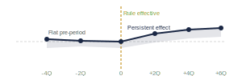

```{r setup}
fig_dir <- "output/paper/figures/"
fig_include <- function(path) {
  if (file.exists(path)) {
    knitr::include_graphics(path)
  } else {
    cat(paste0('<div class="fp"><span>Figure: ', basename(path), '</span></div>'))
  }
}
```

## {background-color="#1a2744"}

::: {.title-block}
[NCUA · Office of the Chief Economist]{.title-org}

[The 2022 NCUA Risk-Based Capital Rule]{.title-main}

[Empirical Findings from an Analysis of Complex Credit Unions]{.title-sub}

---

[NCUA Call Report Data, 2000–2025 · April 2026]{.title-meta}
:::

## What We Studied {.slide}

::: {.columns}
::: {.column width="55%"}
[The Data]{.lbl}

- **696 complex credit unions** — avg assets ≥ $500M, classified using 2021 data
- **~4,488 non-complex credit unions** as the comparison group  
- **150,000+ CU-quarters** of NCUA Call Report data, 2000–2025
- **12 outcomes**: capital, loan rates, volume, portfolio mix, profitability, loan quality

[The Method: Difference-in-Differences (DiD)]{.lbl}

::: {.method-row}
::: {.mbox}
**Change in complex CUs**  
Before vs. after rule
:::
::: {.mop}
−
:::
::: {.mbox}
**Change in non-complex CUs**  
Same time window
:::
::: {.mop}
=
:::
::: {.mres}
**The Rule's Effect**  
Isolated from the economy
:::
:::

::: {.cb}
**Why this works:** Non-complex CUs faced the same economic conditions but were not subject to the RBC rule. Any difference between the two groups, after accounting for pre-existing trends, isolates the rule's effect.
:::
:::

::: {.column width="3%" .col-div}
:::

::: {.column width="42%"}
[How to Read the Event Study Charts]{.lbl}

::: {.ib}
- **Horizontal axis:** quarters relative to rule's effective date (Q0). Left = before; right = after.
- **Vertical axis:** estimated gap between complex and non-complex CUs above any pre-existing difference.
- **Before Q0:** dots near zero confirm both groups moved together — the parallel trends check.
- **After Q0:** a persistent move is the rule's estimated effect. Shaded band = 95% confidence interval.
- **Band crosses zero:** effect not statistically distinguishable from no effect at that quarter.
:::

{width="100%"}

[Schematic only — actual charts on subsequent slides]{.fn}
:::
:::

## RQ 1 — Pre-Rule Capital Buffer {.slide}

[Research Question 1]{.bdg-rq}

**How much capital buffer did complex credit unions hold before the rule?**

::: {.abar}
Answer: The average complex credit union entered the rule with a buffer of just **72 basis points** above the new 10% threshold — leaving very little room to absorb the new requirement.
:::

::: {.columns}
::: {.column width="55%"}
[What the Data Show]{.lbl}

- Complex CUs are the largest, most systemically significant institutions in the credit union system — those with average assets at or above $500 million
- Before the rule, the typical complex CU held capital just barely above the existing standard; the new 10% threshold was meaningfully higher
- Capital was **tightly clustered just above the old threshold** — a large share barely on the compliant side
- This thin starting position directly explains the large downstream effects — institutions had to act immediately and significantly

:::
::: {.column width="3%" .col-div}
:::
::: {.column width="42%"}

::: {.cb}
**What is a basis point?** One bp = one one-hundredth of a percentage point. A 72bp buffer means 10.72% capital against a 10.00% threshold.
:::

::: {.stat-row}
::: {.stat-card}
[72bp]{.sn}  
[Average pre-rule buffer above the 10% threshold]{.sl}
:::
::: {.stat-card .red}
[696]{.sn}  
[Complex CUs subject to the rule (fixed 2021 classification)]{.sl}
:::
:::

::: {.cb}
**Why it matters:** A rule requiring additional capital is always more costly when institutions start with little room to spare. This thin buffer set the stage for the pressures in RQ2–RQ4.
:::
:::
:::

## RQ 2 — Did Capital Levels Rise? {.slide}

[Research Question 2]{.bdg-rq}

**Did the rule cause complex credit unions to hold more capital?**

::: {.abar}
Answer: **Mixed.** Average capital rose — but fewer institutions are now meeting the well-capitalized standard. The bar rose faster than capital could accumulate.
:::

::: {.columns}
::: {.column width="55%"}

::: {.stat-row}
::: {.stat-card .green}
[+46bp]{.sn}  
[Net worth ratio increase (p < 0.01)]{.sl}
:::
::: {.stat-card .red}
[-3.7pp]{.sn}  
[Well-capitalized probability change (p < 0.01)]{.sl}
:::
:::

[The Paradox Explained]{.lbl}

- Capital rose — institutions responded to the rule's incentive to build reserves
- But the **definition of well-capitalized changed** simultaneously, raising the bar further
- Result: more capital on average, but **fewer institutions clearing the new bar**

::: {.cb}
**Analogy:** Every student studied harder and raised their score — but the passing grade was raised even more. Average scores went up, yet more students are technically failing. Both facts are simultaneously true.
:::
:::
::: {.column width="3%" .col-div}
:::
::: {.column width="42%"}

[Event Study — Capital]{.lbl}

```{r fig-rq2, results="asis"}
fig_include(file.path(fig_dir, "Figure3_EventStudy_Capital.png"))
```

[Pre-period flat confirms parallel trends. Post-period divergence attributed to the rule.]{.fn}
:::
:::

## RQ 3 — Did Loan Rate Spreads Change? {.slide}

[Research Question 3]{.bdg-rq}

**Did loan rate spreads change significantly after the RBC rule?**

::: {.abar}
Answer: Yes — across every loan type, by large and economically meaningful amounts. The evidence indicates complete pass-through to member-borrowers.
:::

::: {.columns}
::: {.column width="55%"}

[Loan Rate Increases vs. Non-Complex CUs]{.lbl}

::: {.stat-row}
::: {.stat-card .red}
[+73bp]{.sn .sm}  
[Mortgage spread]{.sl}
:::
::: {.stat-card .red}
[+56bp]{.sn .sm}  
[New auto spread]{.sl}
:::
::: {.stat-card .red}
[+76bp]{.sn .sm}  
[Used auto spread]{.sl}
:::
::: {.stat-card .red}
[+66bp]{.sn .sm}  
[Commercial spread]{.sl}
:::
:::

- All effects significant at the 0.1% level; persist 10+ quarters with no convergence
- Credit unions raised rates to cover higher capital costs rather than absorbing them internally — the entire regulatory cost was transferred to member-borrowers
- A 73bp mortgage increase on a $300,000 loan adds roughly **$130 per month**

```{r fig-rq3, results="asis"}
fig_include(file.path(fig_dir, "Figure4_EventStudy_Spreads.png"))
```

:::
::: {.column width="3%" .col-div}
:::
::: {.column width="42%"}

[Lending Volume]{.lbl}

::: {.stat-row}
::: {.stat-card .red}
[-0.44pp]{.sn .sm}  
[Quarterly loan growth — persistent, no recovery]{.sl}
:::
:::

- Loan growth fell **0.44pp per quarter** — compounding into a substantial reduction in credit availability
- The contraction is not a temporary adjustment — no recovery observed through 10+ quarters
- This is a supply-side effect: credit unions pulled back on lending to conserve capital, not because member demand declined

```{r fig-rq3b, results="asis"}
fig_include(file.path(fig_dir, "Figure3b_EventStudy_LoanGrowth.png"))
```
:::
:::

## RQ 4 — Portfolio Shift and Crisis Comparison {.slide}

[Research Question 4]{.bdg-rq}

**Did asset and loan growth change — and how does this compare to the 2008 crisis?**

::: {.abar}
Answer: Yes. Complex CUs shifted from auto loans toward mortgages — consistent with risk-weight arbitrage. This shift is unique to the RBC rule; it did not occur during the 2008 financial crisis.
:::

::: {.columns}
::: {.column width="55%"}

::: {.stat-row}
::: {.stat-card .red}
[-4.0pp]{.sn}  
[Auto loan share (vs. controls)]{.sl}
:::
::: {.stat-card .green}
[+2.4pp]{.sn}  
[Real estate loan share]{.sl}
:::
:::

- Under the RBC rule, different loan types carry different capital requirements. Mortgages carry a lower requirement than auto loans — so shifting to mortgages reduces required capital, a rational institutional response
- Delinquency rates rose **+8bp**, driven by a capacity channel — CUs with the largest profitability declines showed 2× the delinquency increase

```{r fig-rq4, results="asis"}
fig_include(file.path(fig_dir, "Figure5_Portfolio_Trends.png"))
```
:::
::: {.column width="3%" .col-div}
:::
::: {.column width="42%"}

[Comparison to the 2008 Financial Crisis]{.lbl}

::: {.cb}
We ran the same analysis using 2008 as the event, comparing how complex CUs responded to the financial crisis vs. the RBC rule.
:::

| Outcome | 2008 Crisis | RBC Rule |
|:--------|:-----------:|:--------:|
| Capital accumulation | Similar | Similar |
| Auto loan exit | Not observed | **Permanent** |
| Loan growth | Temporary | **No recovery** |
| Profitability | Temporary | **No recovery** |

Capital behavior resembles a crisis response — but the lending and profitability effects are **distinctly regulatory** in character and persistence.

```{r fig-rq4b, results="asis"}
fig_include(file.path(fig_dir, "Figure6_Crisis_vs_RBC_Capital.png"))
```
:::
:::

## Supporting Finding — Profitability {.slide}

[Supporting Finding]{.bdg-intro}

**Profitability Declined Persistently — Largest Institutions Hit Hardest**

::: {.abar}
Return on assets fell across complex CUs — with the largest institutions experiencing the sharpest declines. This directly informs the financial stability question in RQ5.
:::

::: {.columns}
::: {.column width="55%"}

::: {.stat-row}
::: {.stat-card .red}
[-26bp]{.sn}  
[Average ROA decline — all complex CUs (p < 0.01)]{.sl}
:::
::: {.stat-card .red}
[-47bp]{.sn}  
[ROA decline for CUs above $10B in assets]{.sl}
:::
:::

- ROA decline is **persistent** — no evidence of adaptation or recovery through the observation window
- Largest CUs (above $10B) experience a decline **nearly double the average**
- CCULR provided **no significant relief** on lending outcomes; CCULR adopters showed worse baseline outcomes consistent with distressed self-selection
:::
::: {.column width="3%" .col-div}
:::
::: {.column width="42%"}

::: {.cb}
**Why this matters:** Lower profitability reduces organic capital-building ability. A CU that cannot retain earnings must raise rates, cut lending, or draw down its capital ratio — all three patterns appear in the data.
:::

::: {.cb}
**CCULR finding:** The Community Credit Union Leverage Ratio was designed as a simpler compliance pathway. The data suggest institutions most likely to adopt it were already under stress — CCULR adoption did not cause or reverse their worse outcomes.
:::

```{r fig-roa, results="asis"}
fig_include(file.path(fig_dir, "Figure3d_EventStudy_ROA.png"))
```
:::
:::

## RQ 5 — Financial Stability Implications {.slide}

[Research Question 5]{.bdg-rq}

**What does the data show about the rule's financial stability implications?**

::: {.abar}
Answer: The rule provides a modest and quantifiable degree of protection against institutional failure — but the protection is small relative to the costs imposed on member-borrowers.
:::

::: {.columns}
::: {.column width="55%"}

[Capital Adequacy Stress Test — At 2008 GFC Severity]{.lbl}

::: {.stat-row}
::: {.stat-card}
[19.1%]{.sn .sm}  
[Pre-rule failure rate (baseline)]{.sl}
:::
::: {.stat-card .green}
[19.4%]{.sn .sm}  
[With-rule (−0.3pp incremental protection)]{.sl}
:::
::: {.stat-card .red}
[22.5%]{.sn .sm}  
[Without-rule (+3.4pp ≈ 24 institutions)]{.sl}
:::
:::

- At 2008 severity, the rule's incremental protection is −0.3pp — small because complex CUs were already building buffers before the rule
- ~24 institutions, each representing ~$14B in assets, are protected from falling below the 7% legacy floor
- Probability-weighted NCUSIF insurance cost: **$0.4B–$2.2B**

:::
::: {.column width="3%" .col-div}
:::
::: {.column width="42%"}

[Stress Scenario Sensitivity]{.lbl}

| Recession Severity | Welfare Retained | Member Cost |
|:-------------------|:----------------:|:-----------:|
| Moderate | 87% | $284BN |
| Severe | 73% | $238BN |

::: {.cb}
The estimated insurance cost of a reduction in the rule ($0.4B–$2.2B) is substantially smaller than the estimated member welfare cost of keeping it ($325.9BN over 4 years). No stress scenario tested produces a cost-benefit reversal.
:::

```{r fig-rq5, results="asis"}
fig_include(file.path(fig_dir, "Figure9_9_Net_Benefit_Analysis.png"))
```
:::
:::

## Five Questions. Five Answers. {.slide}

[Summary]{.bdg-sum}

```{r summary-table}
library(knitr); library(kableExtra)
df <- data.frame(
  RQ = c("RQ 1","RQ 2","RQ 3","RQ 4","RQ 5"),
  Question = c(
    "How much capital buffer before the rule?",
    "Did complex CUs hold more capital?",
    "Did loan rate spreads change?",
    "Did asset and loan growth change?",
    "What are the financial stability implications?"
  ),
  Finding = c(
    "Critically thin -- 72bp average buffer above the 10% threshold",
    "Mixed -- NW ratio +46bp, but well-capitalized probability -3.7pp",
    "Yes -- complete pass-through confirmed across every loan type",
    "Yes -- both fell sharply; permanent supply-side contraction confirmed",
    "Modest, quantifiable protection -- small relative to member costs"
  ),
  Numbers = c(
    "72bp buffer · 696 complex CUs",
    "NW +46bp · Well-cap prob -3.7pp",
    "Mortgage +73bp · New auto +56bp · Used auto +76bp · Commercial +66bp",
    "Loan growth -0.44pp/qtr · Auto exit permanent · No recovery 10+ qtrs",
    "+3.4pp failure risk · ~24 institutions · NCUSIF $0.4-2.2BN vs $325.9BN cost"
  ),
  stringsAsFactors = FALSE
)
kable(df, col.names=c("RQ","Question","Core Finding","Key Numbers"),
      align=c("c","l","l","l")) |>
  kable_styling(bootstrap_options=c("striped","hover"),
                full_width=TRUE, font_size=12) |>
  column_spec(1, bold=TRUE, color="#1a2744", width="4%") |>
  column_spec(2, width="22%") |>
  column_spec(3, width="36%", bold=TRUE, color="#1a2744") |>
  column_spec(4, width="38%") |>
  row_spec(0, background="#1a2744", color="white", bold=TRUE)
```

::: {.summary-note}
**Across all five research questions**, the findings are consistent: complex credit unions responded to the rule's capital incentive primarily through higher loan rates, reduced lending volume, portfolio reallocation, and lower profitability — rather than through material improvements in financial stability outcomes at the system level.
:::
